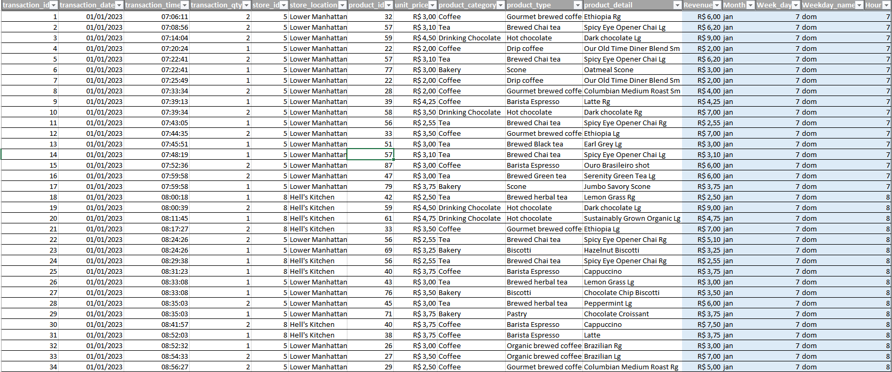
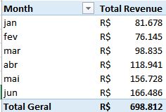
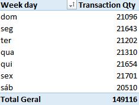
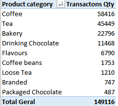
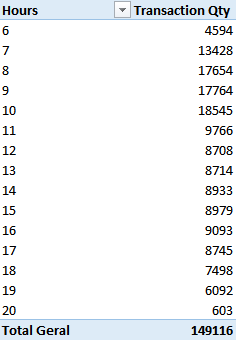
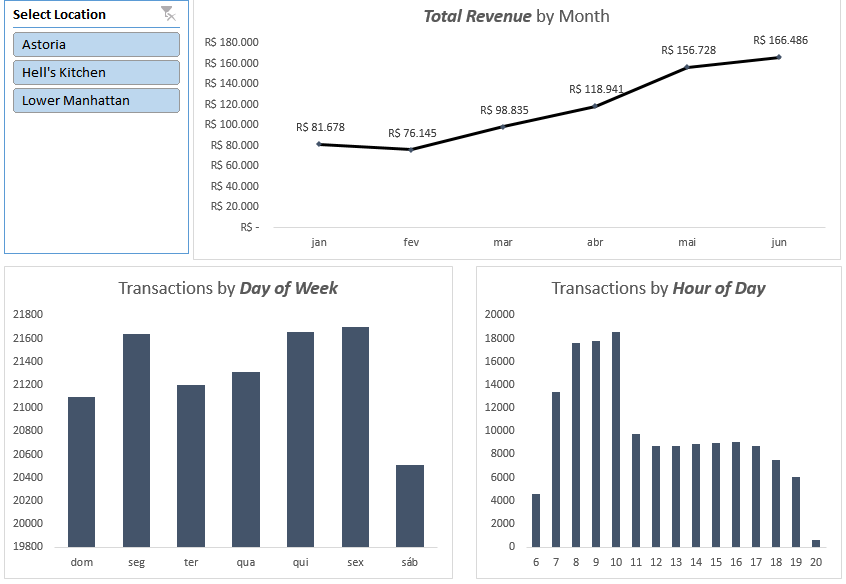
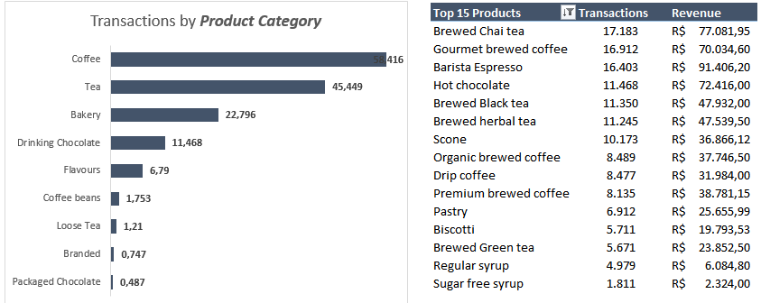

# Coffee Shop Data Analysis Project ☕📊

This repository contains a data analysis project using transaction data from a coffee shop. Various data transformations were applied, pivot tables were built, and charts were generated to extract relevant business insights.

---

## 🔍 Project Steps

### Step 1: Data Preparation  
Several transformations were applied to the data in Excel to improve its analysis and visualization:

1. **Created a `Revenue` column**  
   Formula: `transaction_qty * unit_price`
   
2. **Created a `Month` column** for easier interpretation  
   Formula: `MONTH(transaction_date)`

3. **Created two columns for the day of the week:**  
   - **`Week_day`**: Numeric day of the week using `WEEKDAY(transaction_date)`  
   - **`Weekday_name`**: Abbreviated name of the day using `TEXT(transaction_date, "DDD")`
   
4. **Created an `Hour` column**  
   Formula: `HOUR(transaction_time)`

---

### Step 2: Pivot Tables Creation  
The following pivot tables were built to summarize and analyze the data:  

1. **Total Revenue by Month**  
   Columns: `Revenue` and `Month`  

2. **Transaction Count by Day of the Week**  
   Columns: `Weekday_name` and `transaction_qty`  

3. **Transaction Count by Product Category**  
   Columns: `product_category` and `transaction_qty`  

4. **Transaction by Hour of Day**  
   Columns: `Hour`, `transaction_qty`.
   

---

### Step 3: Data Visualization  

1. **Total Revenue by Month** – Line Chart: Ideal for displaying trends over time.  

2. **Transactions by Day of the Week** – Column Chart: A column chart clearly highlights differences between weekdays.  

3. **Transactions by Hour of the Day** – Column Chart: Useful for identifying peak transaction times during the day.

4. **Transaction Count and Revenue by Product Type (Top 15)**  

## 🔍 Analysis Summary  

- The analysis showed **total revenue growth** throughout the first half of 2023.  
- The most sold products were from the **Coffee** category, while **Packaged Chocolate** was the least sold.  
- The **busiest hours** were from **7 AM to 11 AM**, indicating that staff should be prioritized during these times. After **7 PM**, sales drop significantly, raising the question of whether operating hours should be reduced.  
- Additionally, the analysis highlighted the **top revenue-generating products** for each of the three stores.  

